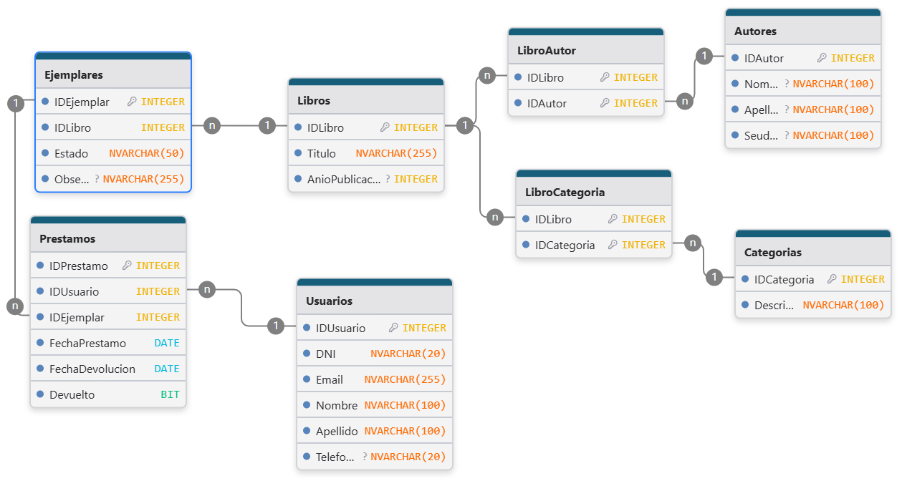

<h1>Trabajo Práctico Integrador - BD2</h1>

<h2>Repositorio público</h2>

Este repositorio contiene el desarrollo del Trabajo Práctico Integrador para la materia Base de Datos 2.

<h2>Requisitos del trabajo</h2>
<ul>
  <li>Trabajo grupal de hasta 4 personas.</li>
  <li>Elaboración de una base de datos para resolver una situación problemática.</li>
  <li>La base de datos debe incluir:
    <ul>
      <li>Al menos 3 vistas.</li>
      <li>Al menos 2 procedimientos almacenados:
        <ul>
          <li>Uno para generar un reporte parametrizado.</li>
          <li>Otro para realizar una acción en la base de datos.</li>
        </ul>
      </li>
      <li>Al menos 2 triggers:
        <ul>
          <li>Uno tras una inserción.</li>
          <li>Uno tras una eliminación.</li>
        </ul>
      </li>
    </ul>
  </li>
  <li>Opcional (valor agregado):
    <ul>
      <li>Trigger tras modificación.</li>
      <li>Vistas basadas en funciones definidas por el usuario.</li>
      <li>Aplicación web o de escritorio conectada a la base de datos.</li>
    </ul>
  </li>
  <li>Entregas semanales de avances.</li>
  <li>Entrega final de:
    <ul>
      <li>Documento PDF con:
        <ul>
          <li>Carátula con integrantes y legajos.</li>
          <li>Descripción del sistema.</li>
          <li>Detalle del uso de vistas, procedimientos y triggers (con código).</li>
        </ul>
      </li>
      <li>Script completo de creación con datos de ejemplo.</li>
      <li>Video demo público (máx. 25 minutos).</li>
    </ul>
  </li>
</ul>

<h2>Estado de avances</h2>
<ul>
  <li>✅ Diagrama Entidad-Relación</li>
  <li>✅ Script de creación</li>
  <li>✅ Script de inserción de datos de prueba</li>
  <li>✅ Vistas
    <ul>
      <li>✅ Vista préstamos activos</li>
      <li>✅ Vista cantidad libros y ejemplares por categoría</li>
      <li>✅ Vista libros disponibles</li>
    </ul>
  </li>
  <li>✅ Procedimientos almacenados
    <ul>
      <li>✅ Procedimiento almacenado para reporte parametrizado</li>
      <li>✅ Procedimiento almacenado para resolver acción en BD</li>
    </ul>
  </li>
  <li>✅ Triggers
    <ul>
      <li>✅ Trigger tras inserción de préstamo</li>
      <li>✅ Trigger tras eliminación de préstamo</li>
    </ul>
  </li>
  <li>⬜ Documento PDF</li>
  <li>⬜ Video demo</li>
</ul>

<h2>DER (Diagrama Entidad-Relación)</h2>

